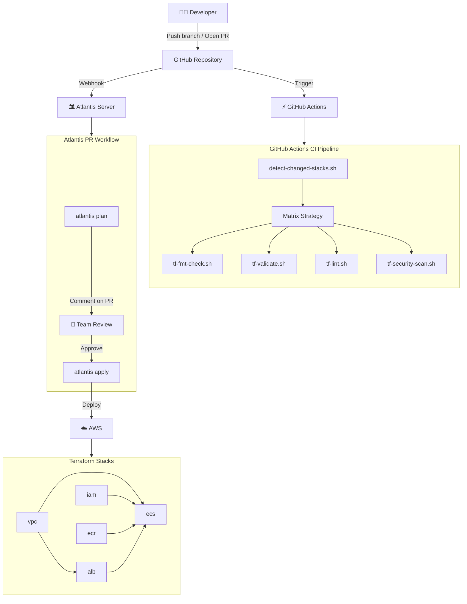
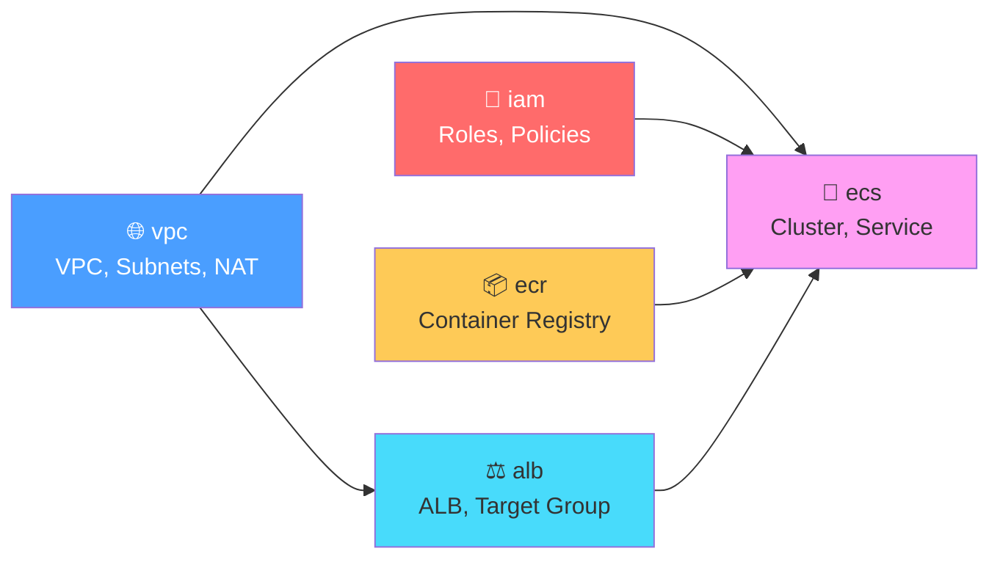

# Architecture

## How It All Fits Together



## Stack Dependency Graph



## Flow: What Happens on a PR

1. **Developer** pushes changes to a branch and opens a PR
2. **GitHub** triggers both GitHub Actions and Atlantis via webhooks

### GitHub Actions Path (CI)
3. `detect-changed-stacks.sh` identifies which `stacks/` directories have changes
4. A **matrix job** runs per changed stack in parallel:
   - `tf-fmt-check.sh` — ensures code is properly formatted
   - `tf-validate.sh` — syntax and configuration validation (no AWS creds needed)
   - `tf-lint.sh` — best-practice rules via tflint
   - `tf-security-scan.sh` — security scanning via tfsec/trivy
5. Results appear as **status checks** on the PR

### Atlantis Path (Plan/Apply)
6. Atlantis detects changed projects via `atlantis.yaml` autoplan rules
7. Atlantis runs `terraform plan` for each affected project
8. Plan output is **posted as a comment** on the PR
9. Team members review the plan and the code changes
10. Once the PR has required **approvals** and is **mergeable**, someone comments `atlantis apply`
11. Atlantis runs `terraform apply` and posts the result

### Drift Detection (Scheduled)
- A **weekly cron** job runs `terraform plan` on all stacks against `main`
- If drift is detected (exit code 2), a **GitHub issue** is automatically created

## Remote State Architecture

Each stack has its own state file in a shared S3 bucket:

```
s3://atlasian-demo-tfstate/
├── vpc/terraform.tfstate
├── iam/terraform.tfstate
├── ecr/terraform.tfstate
├── alb/terraform.tfstate
└── ecs/terraform.tfstate
```

Stacks reference each other via `terraform_remote_state` data sources. For example, the `alb` stack reads VPC outputs:

```hcl
data "terraform_remote_state" "vpc" {
  backend = "s3"
  config = {
    bucket = "atlasian-demo-tfstate"
    key    = "vpc/terraform.tfstate"
    region = "eu-west-1"
  }
}

# Usage:
subnets = data.terraform_remote_state.vpc.outputs.public_subnet_ids
```

A DynamoDB table (`atlasian-demo-tflock`) provides state locking.
